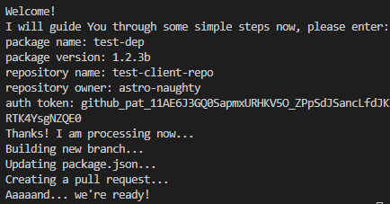
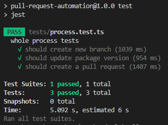
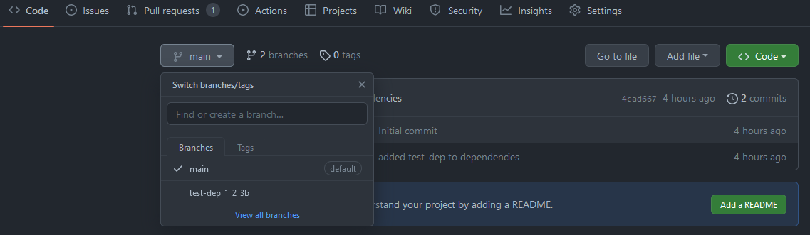
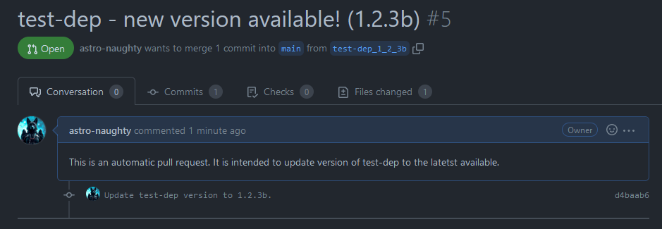
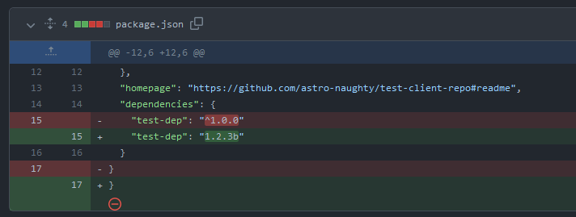

# APR - automatic pull requester

## Description

This sample project amis to pump version of given package in given repository.
Main idea here is to get package name and version from the user along with repository information and go throuh few simple steps:

- create a new branch based on master branch of given repository
- fetch and update package.json file on branch created in previous step
- create pull request to master branch

Since I don't have BitBucket account I assumed that the process would be similar to one using GitHub, which I choose to work with in this project.
It should be fairly simple to update the code to use BitBucket, but I didn't want to risk problems taking into account short amount of time.

## Usage

Simply run in your cmd:

```
// for production mode
npm start

// for development watch mode
npm run watch
```

## Testing

There is one simple test already written, but it requires .env file to be set according to .env.example.
Ater stting up .env file You can run test using:

```
npm test
```

## Example results

**User's input**  


**Tests**  


**New branch**  


**Pull request**  


**File changes**  


## Todo

- introduce error handling
- verify succes/failure of each request
- update nodemon config to watch only required files
- introduce version validation, ( fe. we would not wont to update version if it is not realy new one or if it is breaking and package.json stands that breaking changes should not be updated )
- switch from ts-node to a more production ready approach (fe. bundling and using node)
- manage credentials
- look for both master and main branches
